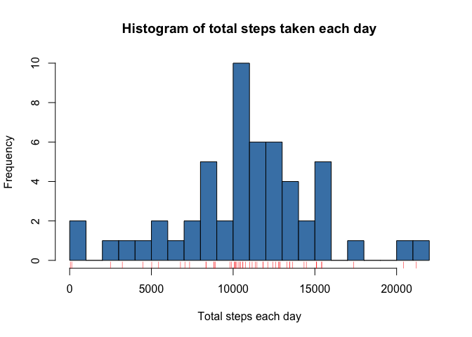
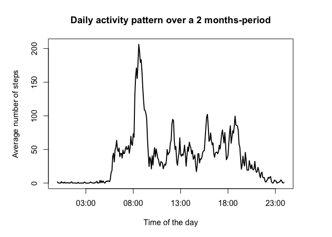
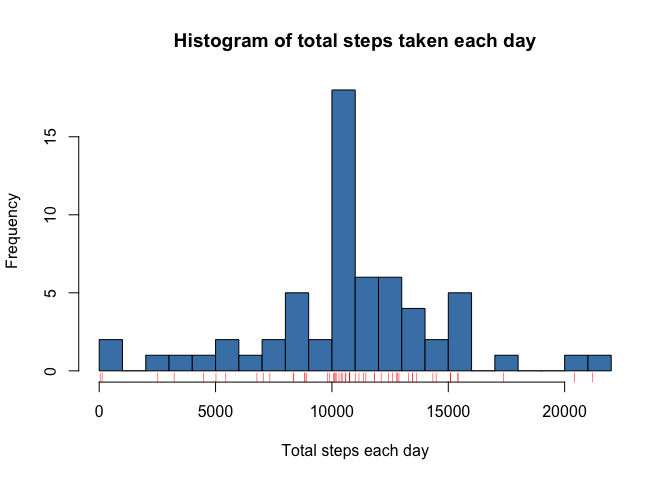
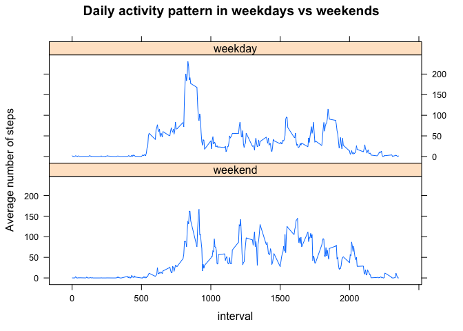

# Fitness Tracker Daily Activity Pattern Identification
Wei Wei  
April 2, 2016  


## Introduction

It is now possible to collect a large amount of data about personal movement using activity monitoring devices. As a course assignment in the Coursera Data Science Specialization series, this exploratory data analysis makes use of data from a personal activity monitoring device to identify the daily activity patterns of the wearer. This device collects data at 5 minute intervals through out the day. The [data][1] consists of two months of data from an anonymous individual collected during the months of October and November, 2012 and include the number of steps taken in 5 minute intervals each day.

[1]: https://d396qusza40orc.cloudfront.net/repdata%2Fdata%2Factivity.zip "data"

## Loading and preprocessing the data


```r
rm(list=ls())

## download file
dataFileUrl <- 'https://d396qusza40orc.cloudfront.net/repdata%2Fdata%2Factivity.zip'

if (!dir.exists('../webData')) {dir.create('../webData')}
if (!file.exists('../webData/activity.zip')) 
    {download.file(dataFileUrl, destfile='../webData/activity.zip', method='curl')}

## unzip into working directory
unzip('../webData/activity.zip')

suppressPackageStartupMessages(library(stringr))
suppressPackageStartupMessages(library(dplyr))

raw <- read.csv("activity.csv", header=TRUE, na.strings="NA", stringsAsFactors=FALSE)
raw$interval <- str_pad(as.character(raw$interval), 4, pad="0")
raw$datetime <- paste(raw$date, raw$interval, sep=" ")
raw$datetime <- strptime(raw$datetime, "%Y-%m-%d %H%M")
str(raw)
```

```
## 'data.frame':	17568 obs. of  4 variables:
##  $ steps   : int  NA NA NA NA NA NA NA NA NA NA ...
##  $ date    : chr  "2012-10-01" "2012-10-01" "2012-10-01" "2012-10-01" ...
##  $ interval: chr  "0000" "0005" "0010" "0015" ...
##  $ datetime: POSIXlt, format: "2012-10-01 00:00:00" "2012-10-01 00:05:00" ...
```

## Results

#### Q1: What is mean and median total number of steps taken per day?


```r
raw_day <- select(raw, steps, date)
raw_day$date <- factor(raw_day$date)
stepsPerDay <- raw_day %>% group_by(date) %>% summarize(total=sum(steps))

hist(stepsPerDay$total, col="steelblue", breaks=20,
     xlab="Total steps each day",
     main="Histogram of total steps taken each day")
rug(stepsPerDay$total, col="red")
```



```r
## the mean and median of the total number of steps taken per day
mean(stepsPerDay$total, na.rm=TRUE); median(stepsPerDay$total, na.rm=TRUE)
```

```
## [1] 10766.19
```

```
## [1] 10765
```

<br>

#### Q2: What is the average daily activity pattern? In which 5-min window were the most steps taken on average each day?


```r
raw2 <- select(raw, steps, datetime)
raw2$datetime <- format(strptime(raw2$datetime, "%Y-%m-%d %H:%M:%S"), "%H%M")
raw2 <- rename(raw2, interval=datetime)
raw2$interval <- factor(raw2$interval)
dailyPattern <- raw2 %>% group_by(interval) %>% summarize(avg=mean(steps, na.rm=TRUE))
dailyPattern$interval <- strptime(dailyPattern$interval, "%H%M") ## convert back to time series

par(mar=c(5.1, 5.1, 4.1, 4.1))
plot(dailyPattern$interval, dailyPattern$avg, type="l", lwd=2, xaxt="n",
     xlab="Time of the day", 
     ylab="Average number of steps") 
axis.POSIXct(1, dailyPattern$interval)
title(main="Daily activity pattern over a 2 months-period")
```



```r
## The 5-min interval with the maximum number of steps on average across all the days in the dataset 
dailyPattern$interval <- as.character(dailyPattern$interval)
dailyPattern <- arrange(dailyPattern, desc(avg))
head(dailyPattern, n=1)
```

```
## Source: local data frame [1 x 2]
## 
##              interval      avg
##                 (chr)    (dbl)
## 1 2016-04-27 08:35:00 206.1698
```

<br>

#### Q3: Re-address question 2 after imputing missing values. 


```r
## the total number of rows with missing values in each column
colSums(is.na(select(raw, -datetime))); table(is.na(raw$steps))
```

```
##    steps     date interval 
##     2304        0        0
```

```
## 
## FALSE  TRUE 
## 15264  2304
```

```r
## replace all NAs in the raw dataset with the average of the 5-min interval over the 2-months period
raw_NA <- raw
dailyPattern <- mutate(dailyPattern, interval=format(strptime(dailyPattern$interval, "%Y-%m-%d %H:%M:%S"), "%H%M"))

for (i in 1:length(raw_NA$steps)) {
        if (is.na(raw_NA$steps[i])) {
                daily_f <- filter(dailyPattern, interval==raw_NA$interval[i])
                raw_NA$steps[i] <- daily_f$avg
        }
        raw_NA
}
```


```r
## the number of NAs after imputing missing values
colSums(is.na(select(raw_NA, -datetime))); table(is.na(raw_NA$steps))
```

```
##    steps     date interval 
##        0        0        0
```

```
## 
## FALSE 
## 17568
```


```r
## histogram after NAs replaced with values
raw_day_NA <- select(raw_NA, steps, date)
raw_day_NA$date <- factor(raw_day_NA$date)
stepsPerDay_NA <- raw_day_NA %>% group_by(date) %>% summarize(total=sum(steps))

hist(stepsPerDay_NA$total, col="steelblue", breaks=20,
     xlab="Total steps each day",
     main="Histogram of total steps taken each day")
rug(stepsPerDay_NA$total, col="red")
```



```r
## the mean and median of the total number of steps taken per day, replacing NAs with values
mean(stepsPerDay_NA$total); median(stepsPerDay_NA$total)
```

```
## [1] 10766.19
```

```
## [1] 10766.19
```

<br>

#### Q4: Are there differences in activity patterns between weekdays and weekends?


```r
raw_wkday <- select(raw_NA, steps, datetime)
raw_wkday <- mutate(raw_wkday, 
                    wkday=factor(weekdays(datetime) %in% c("Saturday", "Sunday"), 
                                 levels=c(TRUE, FALSE), labels=c("weekend", "weekday")))
raw_wkday$datetime <- format(strptime(raw_wkday$datetime, "%Y-%m-%d %H:%M:%S"), "%H%M")
raw_wkday <- rename(raw_wkday, interval=datetime)
wkDailyPattern <- raw_wkday %>% group_by(wkday, interval) %>% summarize(avg=mean(steps))
wkDailyPattern$interval <- as.numeric(wkDailyPattern$interval)

library(lattice)
xyplot(avg ~ interval | wkday, data=wkDailyPattern, type="l", 
        xlab="interval", ylab="Average number of steps", 
        main="Daily activity pattern in weekdays vs weekends", layout=c(1, 2))
```



